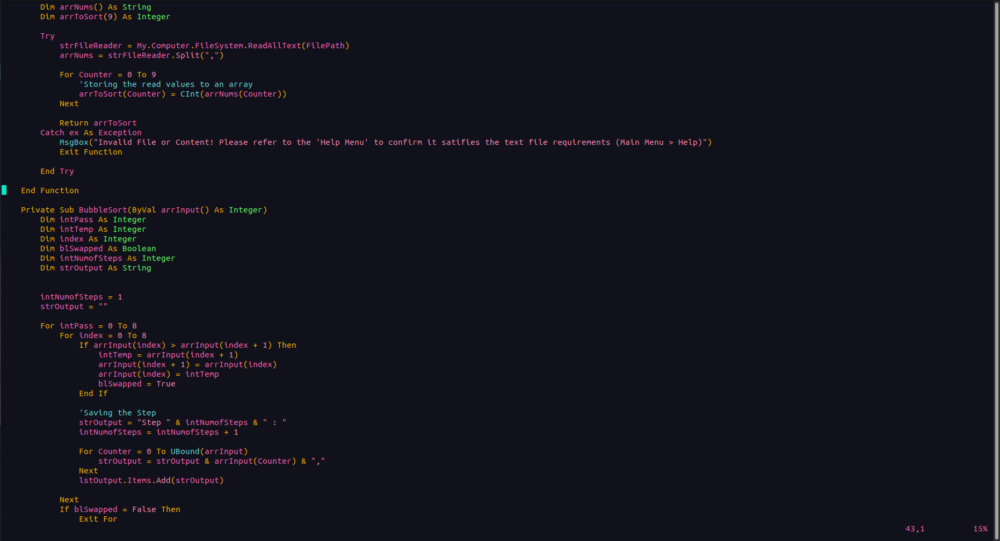

# Blossom Theme for Vim

## Preview




## Installation
1. Download or Clone the repo.
2. locate the ```blossom.vim``` file.
3. place it in the ```~/.vim/colors/``` directory.
4. Activate it using the ```:colorscheme [scheme_name]``` command in your Vim session.

- Enjoy
